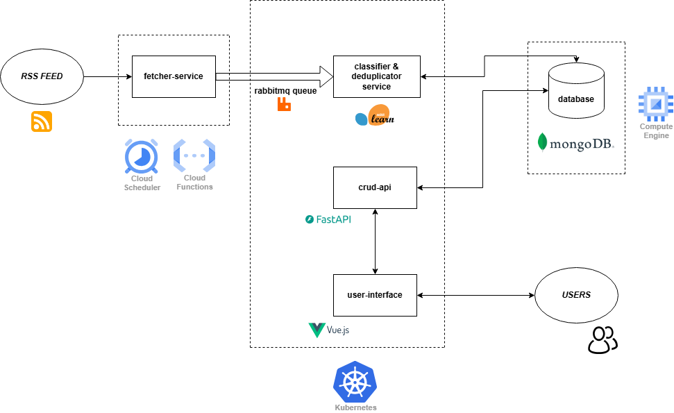

  # Cloud-Native RSS Feed Processing Application

  This cloud-native application is built to collect, process, and serve RSS feed content from a variety of English-language news sources. Designed with modularity and scalability in mind, the system leverages a microservices architecture deployed on Kubernetes, integrating serverless functions, message queues, a NoSQL database, and both frontend and backend components.

  

  The application follows a multi-stage workflow:
  - A **Cloud Scheduler** triggers a **Cloud Function** to initiate the fetch process.
  - The **Fetcher Service** collects RSS data from external news sources and sends it to a **RabbitMQ message queue**.
  - A **deduplicator-classifier** application consumes the queue, detects duplicates, and classifies the articles using a machine learning model.
  - The processed and categorized articles are stored in a **MongoDB** database hosted on a Google Compute Engine VM.
  - A **FastAPI-based backend** provides structured CRUD access to the stored data.
  - A **Vue.js frontend** serves this content to users in a filtered and organized format.

  ## 📁 Project Structure

  ```

  ├── assets/                         # Images used in documentation
  │   ├── cloud-arch.png
  │   └── live.png
  │
  ├── backend/                        # Backend microservices
  │   ├── api-service/                # FastAPI CRUD API
  │   ├── deduplicator-classifier-service/  # ML classification and deduplication
  │   └── fetcher-service/            # RSS feed fetcher (used by Cloud Function)
  │
  ├── cloud-function-scripts/        # GCP Cloud Function & Scheduler deployment
  │   ├── deploy-function.sh
  │   ├── deploy-scheduler.sh
  │   └── function-secrets.yaml
  │
  ├── k8s-scripts/                   # Kubernetes configs and image build script
  │   ├── build-cluster-images.sh
  │   ├── cluster-secrets.yaml
  │   ├── deploy.yaml
  │   └── hpa.yaml
  │
  ├── frontend/                      # Vue.js frontend application
  │
  ├── locust-test/                   # Performance testing with Locust
  │   ├── locustbackend.py
  │   └── locustfrontend.py
  │
  └── README.md
  ```
## ❗Prerequisites on the Local Machine


- Google Cloud SDK (`gcloud`)
- Docker
- kubectl
- Python 3.x and pip
- Locust

## ⚙️ Deployment Steps

  ### 1. MongoDB Setup
  - **Provision a Google Compute Engine VM**: Set up a virtual machine on Google Cloud.
  - **Install MongoDB**: Follow the official MongoDB installation guide for your operating system.
  - **Configure Authentication**: Enable authentication and create necessary users.  
    **Note**: To ensure compatibility with the `cluster-secrets.yaml` file used in deployment, it is encouraged to set:
    - **Username**: `admin`
    - **Password**: `123123123`
  - **Create Firewall Rule**: Allow traffic on port 27017 from the internal Kubernetes network.
  - **Update Secrets**: After setting up the MongoDB instance, edit the `cluster-secrets.yaml` file and set the `MONGO_URI` to the internal IP address of your MongoDB VM. Example:
    ```yaml
    MONGO_URI: mongodb://admin:123123123@<INTERNAL_MONGO_IP>:27017/
  ### 2. Containerization and Image Preparation
  - **Build Docker Images**: Use `build-cluster-images.sh` to build images for deduplicator-classifier-service, crud-api, frontend, and RabbitMQ.

    ⚠️ **Important**: Before building the `frontend` image, make sure to set the correct API endpoint using the `VITE_API_URL` build argument.  
    You must pass the external IP of the deployed `crud-api` service:
      ```bash
      docker build -t frontend:latest --build-arg VITE_API_URL=http://<CRUD_API_EXTERNAL_IP>:8000 .
  - **Create Artifact Registry**: The script will handle the creation if it doesn't exist.
  - **Apply Deployment and HPA Configurations**: Use `kubectl apply -f cluster-secrets.yaml`, `kubectl apply -f deploy.yaml` and `kubectl apply -f hpa.yaml` to deploy the application components and configure Horizontal Pod Autoscalers in your Google Cloud 

  ### 3. Deploy Fetcher Service

  - **Deploy as Google Cloud Function**  
    Use `deploy-function.sh` to package and deploy the `fetcher-service`.

    ⚠️ **Important**: Before deploying, you must update the `function-secrets.yaml` file with the external IP address of the RabbitMQ service.  
    Set the correct connection string in the following format:

    ```yaml
    RABBITMQ_HOST: "<RABBITMQ_IP_ADDRESS"
  ### 4. Set Up Cloud Scheduler
  - **Automate Fetcher Invocation**: Use `deploy-scheduler.sh` to set up a Cloud Scheduler job. Make sure that Project ID and other parameters are correct.

  ### 5. Configure Networking

  - **Apply Firewall Rules**  
    Manually configure VPC firewall rules to allow secure communication between components.  
    - Ensure **MongoDB is reachable from inside the Kubernetes cluster** by allowing internal traffic on port `27017` from cluster node IP ranges.
    - If RabbitMQ is exposed externally, allow access only from trusted IPs or regions.

  - **VPC Connector Configuration**  
    Set up a VPC Connector and attach it to the Cloud Function (`fetcher-service`) to enable private network access.  
    - This allows the **fetcher-service to reach RabbitMQ** securely via internal IP.
    - Additionally, **Kubernetes must be able to access MongoDB** using its internal IP address — this is required for services like `crud-api` and `deduplicator-classifier` to store and retrieve data.


  ### 6. Performance Testing

  - **Deploy Locust for Testing**  
    Use the `locust-test` directory to run performance tests on both backend and frontend components.

    - To test the backend (`crud-api`), use:
      ```bash
      locust -f locustbackend.py --host http://<CRUD_API_EXTERNAL_IP>:8000
      ```
    - To test the frontend, use:
      ```bash
      locust -f locustfrontend.py --host http://<FRONTEND_EXTERNAL_IP>
      ```
    Replace `<CRUD_API_EXTERNAL_IP>` and `<FRONTEND_EXTERNAL_IP>` with the actual external IP addresses of the corresponding services.

    This setup allows you to simulate realistic user behavior, measure response times, and evaluate system performance under load.

  ## 🌐 Website

  [](http://34.39.75.36/)

  🔗 [Visit Live Site](http://34.39.75.36/)

